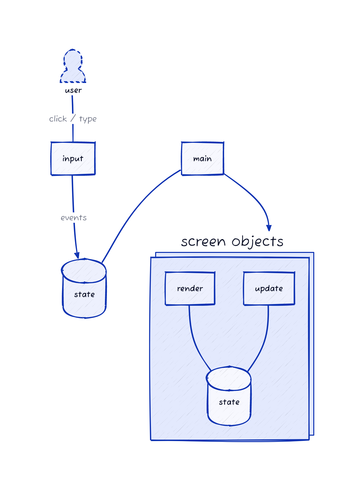
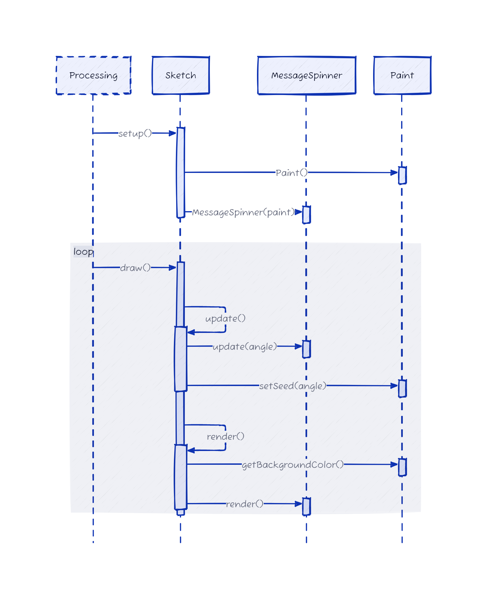
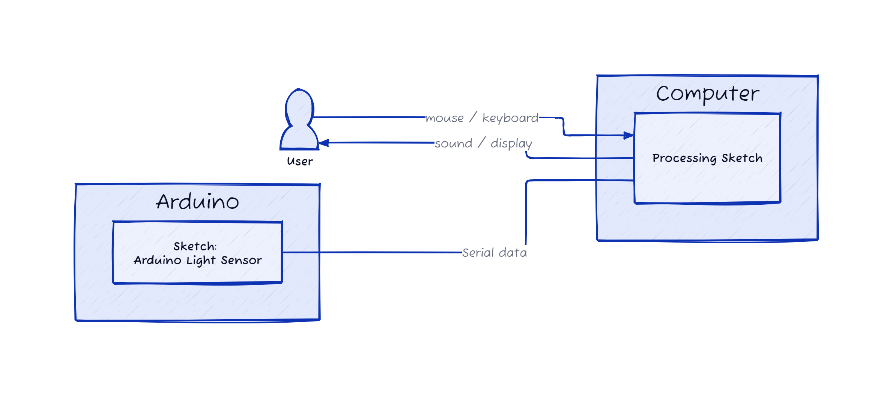

# Documentation

Arkitekturen i en processing sketch kan med fordel opbygges som illustreret i dette diagram.

## Eksempel: Word spin

Her er et sekvensdiagram der illustrerer hvordan koden i word spin eksemplet virker (se processing/word_spin_class).

## Eksempel med Arduino og Processing

For at kunne køre dette eksempel, kræver det at der oprettes kommunikation mellem Arduino og en processing sketch på computeren.

Dette kan blandes med bruger interaktion via mus og tastatur, som vist i dette diagram.

### Arduino koden

Start med at uploade koden i mappen `arduino/arduino_light_sensor` til harwaren.

### Processing sketch: Value display

Koden der skal køre på computern findes i mappen `processing/value_display`.
Bemærk at det kan være nødvendigt at ændre på hvilken seriel port der benyttes. Det skal være den sammen som bruges af arduino. Den kan findes i Arduino IDE i ved at vælge: _Tools &rarr; Port_.